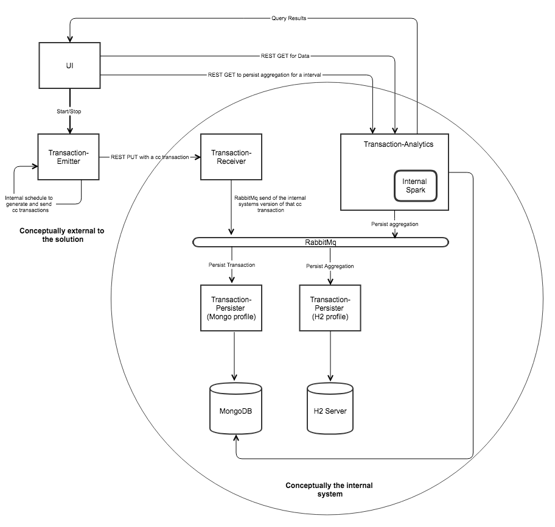

# assignment solution #

The proposed solution was implemented keeping in mind the parameters provided in the challenge, but also the required skills in the jobspeck.
The solution It works consuming generated transactions, and making them available to be aggregated and stored for a set time interval.

## Data Workflow
1. The transaction-emitter produces random credit card transaction, and via rest sends that transaction to the transaction receiver.
2. The transaction-receiver will convert the incoming message to our interval model, and send it on a rabbitMq queue.
3. The transaction-persister while on the “transaction profile” will consume the transaction in mongo dB.
4. A user will connect to the analytics service either through a rest API or the provided UI and, for a timeslice will aggregate the transactions using spark and send the results to rabbit mq.
5. The transaction-receiver in aggregate mode will persist the messages from the rabbit topic to a H2 database server.
6. At any time the user can connect to the UI or though rest and query the full data, the aggregated data, and the persisted aggregations for any timeslice.

## Architecture
It was decided to focus on Java and micro-services, displaying how easy it is not only to scale the system horizontally, but to switch out different parts depending on the situation.
This was the choice as opposed to a more "monolithic" event streaming architecture, in the last session the justification as well as some ways a architecture like that could be implemented is provided in the final section.
 

## Technology stack:
Stateless spring boot 2 micro-services that communicate either through rest or messaging queues.
### Solution Tools
#### MongoDb
Used to store the granular transaction data, chosen for its ease of use, and integration with spark.
#### RabbitMq
A fast messaging service.

**Endpoints**
HOST:15672 - The rabbit admin console, can be accessed from a browser and allows you to check the status of the queues
#### H2 in server mode
A simple relational database, chosen to express how the solution can interact well with multiple data stores and due to its ease of use, and web UI for query.
**Endpoints**

http://HOST:81 -  http console can be accessed at with the connection id =>jdbc:h2:tcp://HOST:1521/hsbc_db
#### Spark in embedded mode
Spark is used for the aggregations and queries on top of mongo, running on embed mode for the sake of simplicity.
#### Vuejs with a axios
A way to execute simple rest calls to the backend providing a light frontend.
#### Docker
Docker was utilized not only for the application components but for the infrastructure.

### Solution components
The components enumerated below make up the solution.
Each piece has a short description, its endpoints and its properties that are more relevant to execution.
#### Transaction-common
The only component that is not deployable, it stores plain pojos for our internal models and construction of said model.
#### Transaction-emitter
The Spring boot service works by emitting random cc transaction at a fixed interval. It was elected for this solution to have it simulate a external system, therefore it has it's own model and send data in plain Jason that needs to be converted

**Endpoints**
/emitter/start - Starts the emitter.
/emitter/stop - stops the emitter.
/emitter/status - returns the current status of the emitter.

**Properties**
server.port - the port the service executes out of, defaults to 8081.
org.gmelo.hsbc.value.lower - the lower bound of the transactional value.
Org.gmelo.hsbc.value.upper - the upper bound of the transactional value.
org.gmelo.hsbc.emitter.interval - the interval in which to publish the messages.
#### Transaction-receiver
The transaction receiver in the data entry point into the system, it provides a rest endpoint for the transaction emitter, and converts the JSON data into the internal model. It then pushes that object to a rabbit queue.

**Endpoints**
/receiver/endpoint - REST endpoint to receive Json messages to convert to the systems internal model and be ingested.

**Properties**
Server.port the port the service executes out of, defaults to 8082
#### Transaction-persistence
The solution runs two instances of this component, with the profiles “transaction-persistence” and “aggregation-persistence” each of them converts the model to a DAO and persists to a data store. This is to keep the model a pure pojo and to allow, if needed to persist the same model to different stores. If any exceptions occur in the persistence the messages moved to the dead letter queue and can be shucked back.
The transaction persister listens on the rabbit queue “” converts the result and persists it to mongo.
The aggregate persister listens on rabbit queue and persist into H2.

 **Endpoints**
  /analytics/query - performs a query for all the aggregated data stored in the system. This endpoint is only available in the aggregation-persistence profile.

**Properties**
spring.profiles.active=transaction-persistence.
In this profile, the default port is 8083 and it connects to mongo
spring.profiles.active=aggregation-persistence
In this profile, the default port is 8085 and it connects to H2
#### Transaction-analytics
The transaction analytics received query requests that are executed by an embeded spark server. It can also receive a request to perform a aggregation and push it to rabbit to be persisted.
**Endpoints**
/analytics/query/freeform - allows for freeform queries into the system using spark with the default spark table name ‘’
/analytics/query/aggregate/{interval}/{unit} - Performs a SUM aggregation to the cc transaction data that that has flowed through the system since the given interval.
/analytics/query/all/{interval}/{unit} -Performs a single query and returns all of the transactions that have been ingested by the system since the given interval.
/analytics/persist/aggregate/{interval}/{unit} -  Performs a SUM aggregation to the cc transaction data that that has flowed through the system since the given interval and sends that data to be persisted for further analysis.
**Properties**
server.port the port the service executes out of, defaults to 8084.
org.gmelo.hsbc.aggregate.sum.query: the query used for the aggregation.
org.gmelo.hsbc.all.query: the query for all the transactions for a given.
#### Pyspark script
a simple script to execute the aggregation using pyspark.
## Execute the solution
### Executing the solution with docker
1. Download all of the files
2. From the hsbc-solution folder
3. Execute mvn clean install
4. Execute mvn dockerfile:build
5. Execute docker-compose
6. Connect to localhost:8080 for the ui

_As a shorthand mvn clean install && mvn dockerfile:build && docker-compose -f infrastructure/docker-compose.yml up can be executed_
### Executing without docker
1. Run mongo dB
2. Run rabbitmq
3. Run H2 in server mode
4. Start webserver with the solution/UI/index.html
5. In your ide, or in the command line start each component, with the default setting except for persister, which should be started twice with the profiles:

## Integration test
From the emitter project from any IDE it is possible to execute org.gmelo.hsbc.assignment.emitter.TransactionEmitterIT,
simply by starting the stripped down version of the docker-compose and running the test. Time constrains and the fact that the UI was finished kept this from being wrapped in
a executable, although it would be trivial to do so.

## Future improvements
### API level
* Improve logging by creating logback.xml and outputting to files.
* Start using a fixed timestamp zone, not using located time.
* Better precision implementation for the numeric data for the aggregations and storage.
* Implement @enableAutoconfiguration to have the properties provided by a service.
* Query sanitization for the queries.
* Stop using auto configuration for data sources and rabbit, and implement the beans.
* Improve serialisation used to something more compressed and cross platform.
* Improve pyspark script to write results to rabbit
* Cross origin requests properly handled.
* Security and access control on UI.
* Handled HTML errors and error pages.
* Allow queries and aggregations from a arbitrary window, not just now-interval.
* Have a transformation service to dynamically convert the data going into the system.
* Bundle the mathematical proof into a integration test.
* Move the integration test to its own module with a runner script
* Add actuator for /health endpoints

### Infrastructure level
* Implement elk stack not only for errors, but for auditing of the flow of data into the system.
* Implement a reverse proxy/load balancing and deploy multiple versions of each component, stopping hard requests, particularly to the receiver and to the analytics framework.
* Deploy a real spark cluster and have the analytics framework connect to is, as opposed to running it standalone.
* Deploy clustered versions of mongo with backups.
* Use a more robust dB then H2.
* Deploy clustered rabbitmq with shovel plugin
* Implement a real, good looking UI
* Run the aggregation and persistence automatically on a schedule.
* Create a real context service with checks and auditing of the data.
* Deploy spring boot admin

### Other solutions
As mentioned in the architecture part , the stack utilized was chosen to display the flexibility and interconnectivity of microservices, as well as ease of deployment/usage, however, other enterprise solutions can be more suited depending on the problem:

* Replacing mongo for a timeseries dB, such as influxDb that has functions to automatically aggregate the data.
* Replacing rabbit with Kafka to automatically aggregate and convert the data, creating a single even stream with endpoints.
* Having the aggregated data stored in a different dB, that is ideally suited for whoever is consuming it.
* Having the data flow into spark directly using spark streaming

